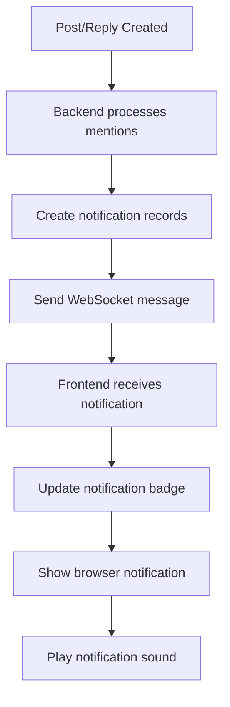
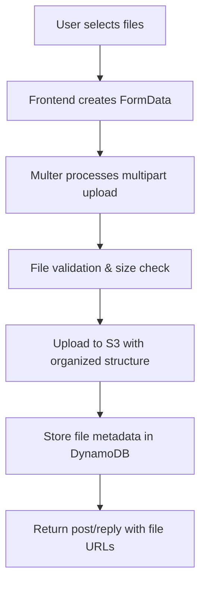
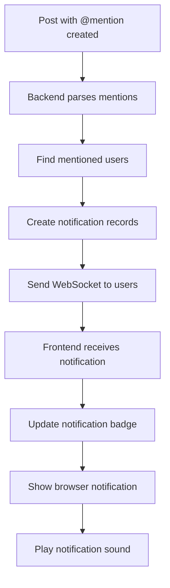

# Post Services System – Context

## 🏗️ Project Overview
- **Purpose**: Real-time communication system for B2B vendor management workspace
- **Tech Stack**: React, Node.js, DynamoDB, WebSockets, AWS services
- **Target Users**: Project managers, vendors, collaborators within workspace
- **Design Philosophy**: Twitter-like threaded conversations with enterprise features

## 📁 Architecture & File Structure

### Frontend Structure
```
PostServices/
├── PostServicesModal.jsx          # Main orchestrator component
├── PostComposer.jsx               # New post creation form
├── PostItem.jsx                   # Individual post display
├── PostList.jsx                   # Posts listing container
├── ReplyComposer.jsx              # Reply creation form
├── ReplyThread.jsx                # Threaded replies display
├── MentionDropdown.jsx            # @ mention dropdown
├── HashtagDropdown.jsx            # # hashtag dropdown
├── hooks/
│   └── usePostServices.js         # Data fetching and state management
└── utils/
    └── textUtils.jsx              # Text highlighting utilities
```

### Backend Structure
```
backend/modules/post-services/
├── controllers/
│   ├── postServiceController.js   # Main API logic
│   └── userLookup.js             # User resolution utilities
├── models/
│   ├── DynamoPostService.js      # DynamoDB operations
│   └── DynamoNotification.js     # Notification operations
├── routes/
│   ├── postServiceRoutes.js      # API routes
│   └── notificationRoutes.js     # Notification routes
├── middleware/
│   └── uploadMiddleware.js       # Multer file upload handling
├── utils/
│   └── s3Upload.js              # S3 file operations
└── scripts/
    └── create-post-services-tables.js # Database setup
```

## 🧭 Data Flow Architecture

### 1. Component Hierarchy
```
PostServicesModal (Orchestrator)
├── PostComposer (Conditional)
│   ├── MentionDropdown
│   ├── HashtagDropdown
│   └── Attachment Management
└── PostList
    └── PostItem (for each post)
        ├── ReplyComposer (Conditional)
        │   ├── MentionDropdown
        │   ├── HashtagDropdown
        │   └── Attachment Management
        └── ReplyThread
            └── ReplyItem (for each reply)
```

### 2. System Architecture Overview
```
┌─────────────────────────────────────────────────────────────────┐
│                    POST SERVICES SYSTEM                        │
├─────────────────────────────────────────────────────────────────┤
│  FRONTEND (React)                    │  BACKEND (Node.js)       │
│  ┌─────────────────────────────────┐ │  ┌─────────────────────┐  │
│  │ PostServicesModal               │ │  │ postServiceRoutes   │  │
│  │ ├── PostComposer                │ │  │ ├── createPost      │  │
│  │ ├── PostList                    │ │  │ ├── createReply     │  │
│  │ │   └── PostItem                │ │  │ ├── getPosts        │  │
│  │ │       ├── ReplyComposer       │ │  │ └── getBySubtask    │  │
│  │ │       └── ReplyThread         │ │  └─────────────────────┘  │
│  │ └── usePostServices Hook        │ │  ┌─────────────────────┐  │
│  └─────────────────────────────────┘ │  │ postServiceController│  │
│  ┌─────────────────────────────────┐ │  │ ├── parseMentions   │  │
│  │ WebSocket Integration           │ │  │ ├── resolveMentions │  │
│  │ ├── useWebSocketNotifications   │ │  │ ├── sendNotifications│  │
│  │ ├── Browser Notifications       │ │  │ └── processAttachments│  │
│  │ └── Sound Effects               │ │  └─────────────────────┘  │
│  └─────────────────────────────────┘ │  ┌─────────────────────┐  │
│                                      │  │ DynamoDB Models     │  │
│                                      │  │ ├── DynamoPostService│  │
│                                      │  │ ├── DynamoNotification│  │
│                                      │  │ └── DynamoWorkspace │  │
│                                      │  └─────────────────────┘  │
│                                      │  ┌─────────────────────┐  │
│                                      │  │ WebSocket Server    │  │
│                                      │  │ ├── notificationSocket│  │
│                                      │  │ ├── userConnections │  │
│                                      │  │ └── realTimeEvents  │  │
│                                      │  └─────────────────────┘  │
└─────────────────────────────────────────────────────────────────┘
```

### 2. State Management Flow
```
PostServicesModal State:
├── Post Creation State
│   ├── message, attachments, isPosting
│   ├── showMentionDropdown, mentionQuery
│   ├── showHashtagDropdown, hashtagQuery
│   └── cursorPosition
├── Reply State
│   ├── replyingTo, replyMessage, isReplying
│   ├── replyAttachments
│   ├── showReplyMentionDropdown, replyMentionQuery
│   ├── showReplyHashtagDropdown, replyHashtagQuery
│   └── replyCursorPosition
└── UI State
    ├── showComposer
    └── posts (from usePostServices hook)
```

## 🔄 State & Data Flow

### 3. Post Creation Flow
```
┌─────────────────────────────────────────────────────────────────┐
│                        POST CREATION FLOW                      │
└─────────────────────────────────────────────────────────────────┘

1. USER INTERACTION
   ┌─────────────┐    ┌──────────────┐    ┌─────────────┐
   │ Click "New  │───▶│ setShowComposer│───▶│ PostComposer│
   │ Post"       │    │ (true)       │    │ renders     │
   └─────────────┘    └──────────────┘    └─────────────┘

2. TEXT INPUT & MENTIONS
   ┌─────────────┐    ┌──────────────┐    ┌─────────────┐
   │ User types  │───▶│ handleMessage│───▶│ @ or #      │
   │ message     │    │ Change       │    │ detected?   │
   └─────────────┘    └──────────────┘    └─────────────┘
                                │
                                ▼
   ┌─────────────┐    ┌──────────────┐    ┌─────────────┐
   │ Show Mention│◀───│ @ detected   │───▶│ Show Hashtag│
   │ Dropdown    │    │              │    │ Dropdown    │
   └─────────────┘    └──────────────┘    └─────────────┘
                                │
                                ▼
   ┌─────────────┐    ┌──────────────┐    ┌─────────────┐
   │ User selects│───▶│ insertMention│───▶│ Update text │
   │ collaborator│    │ /insertHashtag│    │ with mention│
   └─────────────┘    └──────────────┘    └─────────────┘

3. POST SUBMISSION
   ┌─────────────┐    ┌──────────────┐    ┌─────────────┐
   │ Click "Post"│───▶│ handlePost   │───▶│ Send to API │
   │ button      │    │ function     │    │ /api/post-  │
   └─────────────┘    └──────────────┘    │ services    │
                                          └─────────────┘

4. BACKEND PROCESSING
   ┌─────────────┐    ┌──────────────┐    ┌─────────────┐
   │ Parse       │───▶│ Resolve      │───▶│ Create      │
   │ mentions/   │    │ mentions     │    │ notifications│
   │ hashtags    │    │ against      │    │ for mentioned│
   └─────────────┘    │ collaborators│    │ users       │
                      └──────────────┘    └─────────────┘

5. REAL-TIME NOTIFICATIONS
   ┌─────────────┐    ┌──────────────┐    ┌─────────────┐
   │ Send        │───▶│ WebSocket    │───▶│ Frontend    │
   │ WebSocket   │    │ notification │    │ receives    │
   │ messages    │    │ to users     │    │ notification│
   └─────────────┘    └──────────────┘    └─────────────┘

6. UI UPDATE
   ┌─────────────┐    ┌──────────────┐    ┌─────────────┐
   │ Update      │───▶│ setShowComposer│───▶│ Hide        │
   │ local state │    │ (false)      │    │ composer    │
   │ with new    │    │              │    │ & show      │
   │ post        │    │              │    │ updated     │
   └─────────────┘    └──────────────┘    │ post list   │
                                          └─────────────┘
```

### 4. Reply Creation Flow
```
┌─────────────────────────────────────────────────────────────────┐
│                       REPLY CREATION FLOW                     │
└─────────────────────────────────────────────────────────────────┘

1. REPLY INITIATION
   ┌─────────────┐    ┌──────────────┐    ┌─────────────┐
   │ Click       │───▶│ setReplyingTo│───▶│ ReplyComposer│
   │ "reply"     │    │ (postId)     │    │ renders     │
   └─────────────┘    └──────────────┘    └─────────────┘

2. REPLY COMPOSITION
   ┌─────────────┐    ┌──────────────┐    ┌─────────────┐
   │ User types  │───▶│ handleReply  │───▶│ @ or #      │
   │ reply       │    │ MessageChange│    │ detected?   │
   └─────────────┘    └──────────────┘    └─────────────┘
                                │
                                ▼
   ┌─────────────┐    ┌──────────────┐    ┌─────────────┐
   │ Show Reply  │◀───│ @ detected   │───▶│ Show Reply  │
   │ Mention     │    │              │    │ Hashtag     │
   │ Dropdown    │    │              │    │ Dropdown    │
   └─────────────┘    └──────────────┘    └─────────────┘

3. MENTION/HASHTAG INSERTION
   ┌─────────────┐    ┌──────────────┐    ┌─────────────┐
   │ User selects│───▶│ insertReply  │───▶│ Update reply│
   │ collaborator│    │ Mention/     │    │ text with   │
   │ /department │    │ Hashtag      │    │ mention     │
   └─────────────┘    └──────────────┘    └─────────────┘

4. REPLY SUBMISSION
   ┌─────────────┐    ┌──────────────┐    ┌─────────────┐
   │ Click       │───▶│ handleReply  │───▶│ Send to API │
   │ "Reply"     │    │ function     │    │ /api/post-  │
   └─────────────┘    └──────────────┘    │ services/   │
                                          │ reply      │
                                          └─────────────┘

5. BACKEND PROCESSING
   ┌─────────────┐    ┌──────────────┐    ┌─────────────┐
   │ Parse reply │───▶│ Resolve      │───▶│ Create      │
   │ mentions/   │    │ mentions     │    │ reply       │
   │ hashtags    │    │ against      │    │ notifications│
   └─────────────┘    │ collaborators│    └─────────────┘
                      └──────────────┘

6. THREAD UPDATE
   ┌─────────────┐    ┌──────────────┐    ┌─────────────┐
   │ Update      │───▶│ Clear reply  │───▶│ Hide        │
   │ post with   │    │ form &       │    │ ReplyComposer│
   │ new reply   │    │ attachments  │    │ & show      │
   └─────────────┘    └──────────────┘    │ updated     │
                                          │ thread      │
                                          └─────────────┘
```

### 5. Mention & Hashtag Processing Flow
```
┌─────────────────────────────────────────────────────────────────┐
│                MENTION & HASHTAG PROCESSING FLOW              │
└─────────────────────────────────────────────────────────────────┘

1. PATTERN DETECTION
   ┌─────────────┐    ┌──────────────┐    ┌─────────────┐
   │ User types  │───▶│ handleMessage│───▶│ Extract     │
   │ @ or #      │    │ Change       │    │ text before │
   └─────────────┘    └──────────────┘    │ cursor      │
                                          └─────────────┘

2. MENTION PROCESSING
   ┌─────────────┐    ┌──────────────┐    ┌─────────────┐
   │ @ pattern   │───▶│ setMention   │───▶│ setShow     │
   │ detected?   │    │ Query        │    │ Mention     │
   └─────────────┘    └──────────────┘    │ Dropdown    │
                                          │ (true)      │
                                          └─────────────┘
                                │
                                ▼
   ┌─────────────┐    ┌──────────────┐    ┌─────────────┐
   │ Filter      │───▶│ Display      │───▶│ User        │
   │ collaborators│    │ filtered     │    │ selects     │
   │ by query    │    │ list         │    │ mention     │
   └─────────────┘    └──────────────┘    └─────────────┘
                                │
                                ▼
   ┌─────────────┐    ┌──────────────┐    ┌─────────────┐
   │ insertMention│───▶│ Replace      │───▶│ setShow     │
   │ function    │    │ @query with  │    │ Mention     │
   └─────────────┘    │ @name        │    │ Dropdown    │
                      └──────────────┘    │ (false)     │
                                          └─────────────┘

3. HASHTAG PROCESSING
   ┌─────────────┐    ┌──────────────┐    ┌─────────────┐
   │ # pattern   │───▶│ setHashtag   │───▶│ setShow     │
   │ detected?   │    │ Query        │    │ Hashtag     │
   └─────────────┘    └──────────────┘    │ Dropdown    │
                                          │ (true)      │
                                          └─────────────┘
                                │
                                ▼
   ┌─────────────┐    ┌──────────────┐    ┌─────────────┐
   │ Filter      │───▶│ Display      │───▶│ User        │
   │ departments │    │ filtered     │    │ selects     │
   │ by query    │    │ list         │    │ hashtag     │
   └─────────────┘    └──────────────┘    └─────────────┘
                                │
                                ▼
   ┌─────────────┐    ┌──────────────┐    ┌─────────────┐
   │ insertHashtag│───▶│ Replace      │───▶│ setShow     │
   │ function    │    │ #query with  │    │ Hashtag     │
   └─────────────┘    │ #department  │    │ Dropdown    │
                      └──────────────┘    │ (false)     │
                                          └─────────────┘
```

### 6. Real-time Notification Flow
```
┌─────────────────────────────────────────────────────────────────┐
│                    REAL-TIME NOTIFICATION FLOW                │
└─────────────────────────────────────────────────────────────────┘

1. POST/REPLY CREATION
   ┌─────────────┐    ┌──────────────┐    ┌─────────────┐
   │ Post/Reply  │───▶│ Backend      │───▶│ Parse       │
   │ submitted   │    │ receives     │    │ mentions/   │
   └─────────────┘    │ request      │    │ hashtags    │
                      └──────────────┘    └─────────────┘

2. MENTION RESOLUTION
   ┌─────────────┐    ┌──────────────┐    ┌─────────────┐
   │ Find        │───▶│ Get workspace│───▶│ Match       │
   │ mentioned   │    │ collaborators│    │ mentions    │
   │ users       │    │ from pm_     │    │ against     │
   └─────────────┘    │ projects     │    │ collaborator│
                      └──────────────┘    │ names       │
                                          └─────────────┘

3. NOTIFICATION CREATION
   ┌─────────────┐    ┌──────────────┐    ┌─────────────┐
   │ Create      │───▶│ Store in     │───▶│ Prepare     │
   │ notification│    │ post_services│    │ WebSocket   │
   │ records     │    │ _notifications│    │ messages    │
   └─────────────┘    │ _table       │    └─────────────┘
                      └──────────────┘

4. WEBSOCKET DELIVERY
   ┌─────────────┐    ┌──────────────┐    ┌─────────────┐
   │ Send        │───▶│ WebSocket    │───▶│ Frontend    │
   │ notification│    │ server       │    │ receives    │
   │ to users    │    │ delivers     │    │ notification│
   └─────────────┘    │ message      │    └─────────────┘
                      └──────────────┘

5. FRONTEND NOTIFICATION
   ┌─────────────┐    ┌──────────────┐    ┌─────────────┐
   │ Update      │───▶│ Show browser │───▶│ Play        │
   │ notification│    │ notification │    │ notification│
   │ badge       │    │ popup        │    │ sound       │
   └─────────────┘    └──────────────┘    └─────────────┘
```

## 🔌 API & Integrations

### 1. Backend Endpoints
```
POST /api/post-services
- Creates new post
- Processes mentions and hashtags
- Sends notifications

POST /api/post-services/reply
- Creates new reply
- Processes reply mentions and hashtags
- Sends reply notifications

GET /api/post-services/:workspaceId
- Fetches all posts for workspace
- Separates posts and replies
- Organizes into threaded structure

GET /api/post-services/:workspaceId/subtask/:subtaskId
- Fetches posts for specific subtask
- Filters by subtaskId
- Returns threaded structure
```

### 2. WebSocket Integration


### 3. S3 File Storage Integration


#### S3 Bucket Structure
```
workspace--uploads/
└── post_services/
    └── {workspaceId}/
        ├── {postId}/
        │   ├── {unique-filename-1}.jpg
        │   └── {unique-filename-2}.pdf
        └── {reply-postId}/
            └── {unique-filename-3}.png
```

#### File Upload Process
1. **Frontend**: Sends files via FormData with multipart/form-data
2. **Multer Middleware**: Processes multipart uploads, stores in memory
3. **File Validation**: Checks file type, size (10MB max), count (5 max)
4. **S3 Upload**: Files uploaded to organized folder structure
5. **Database Storage**: File metadata stored in DynamoDB attachments array
6. **Response**: Post/reply returned with file URLs and metadata

#### Supported File Types
- **Images**: JPEG, JPG, PNG, GIF, WebP
- **Documents**: PDF, DOC, DOCX, XLS, XLSX
- **Text**: TXT, CSV
- **Archives**: ZIP

#### File Security Features
- **Private Access**: Files stored with private ACL
- **Presigned URLs**: Secure temporary access URLs
- **Unique Filenames**: UUID-based naming prevents conflicts
- **Size Limits**: 10MB per file, 5 files per request
- **Type Validation**: Only allowed file types accepted

### 4. Database Schema
```javascript
// post_services_table
{
  postId: "string",           // Primary key
  workspaceId: "string",      // Partition key
  senderId: "string",         // User ID
  senderName: "string",       // Display name
  senderEmail: "string",      // User email
  senderRole: "string",       // User role
  content: "string",          // Post content
  subtaskId: "string",        // Associated subtask
  taskId: "string",           // Associated task
  attachments: [              // File attachments with S3 details
    {
      fileName: "string",     // Original filename
      fileSize: "number",     // File size in bytes
      fileType: "string",     // MIME type
      fileUrl: "string",      // S3 URL
      s3Key: "string",        // S3 object key
      uniqueFileName: "string" // Unique filename in S3
    }
  ],
  replies: [                  // Nested replies array
    {
      replyId: "string",      // Unique reply ID
      senderId: "string",     // Reply author ID
      senderName: "string",   // Reply author name
      senderEmail: "string",  // Reply author email
      senderRole: "string",   // Reply author role
      content: "string",      // Reply content
      attachments: [{}],      // Reply attachments
      mentions: ["string"],   // Reply mentions
      hashtags: ["string"],   // Reply hashtags
      createdAt: "timestamp",
      updatedAt: "timestamp"
    }
  ],
  mentions: ["string"],       // Resolved mention names
  hashtags: ["string"],       // Extracted hashtags
  createdAt: "timestamp",
  updatedAt: "timestamp"
}

// post_services_notifications_table
{
  notificationId: "string",   // Primary key
  userId: "string",           // Partition key
  postId: "string",           // Related post
  type: "mention|reply",      // Notification type
  message: "string",          // Notification text
  isRead: "boolean",          // Read status
  createdAt: "timestamp"
}
```

## 🎨 Design System

### 1. Color Scheme
```css
/* Mentions */
.text-green-600 { color: #059669; }  /* @ mentions */
.bg-green-50 { background: #ecfdf5; }

/* Hashtags */
.text-purple-600 { color: #9333ea; } /* # hashtags */
.bg-purple-50 { background: #faf5ff; }

/* Buttons */
.bg-blue-600 { background: #2563eb; } /* Primary actions */
.bg-gray-100 { background: #f3f4f6; } /* Secondary actions */
```

### 2. Typography Scale
```css
/* Main content */
text-[11px] { font-size: 11px; }     /* Post content */
text-[10px] { font-size: 10px; }     /* Metadata */
text-[9px] { font-size: 9px; }       /* Small buttons */

/* Line heights */
leading-[1.3] { line-height: 1.3; }  /* Compact text */
leading-relaxed { line-height: 1.625; } /* Readable text */
```

### 3. Spacing System
```css
/* Padding */
p-3 { padding: 12px; }        /* Container padding */
p-2 { padding: 8px; }         /* Component padding */
p-1.5 { padding: 6px; }       /* Compact padding */

/* Margins */
space-y-2 { margin-top: 8px; } /* Vertical spacing */
gap-1 { gap: 4px; }           /* Small gaps */
gap-1.5 { gap: 6px; }         /* Medium gaps */
```

## 🧩 Component Patterns

### 1. Conditional Rendering
```jsx
// Composer visibility
{showComposer && <PostComposer />}

// Reply composer
{replyingTo === post.id && <ReplyComposer />}

// Attachments
{attachments.length > 0 && <AttachmentChips />}
```

### 2. State Lifting
```jsx
// State managed in parent, passed down
const [message, setMessage] = useState('');
<PostComposer 
  message={message} 
  setMessage={setMessage} 
/>
```

### 3. Event Handling
```jsx
// Custom handlers for complex logic
const handleMessageChange = (e) => {
  // Detect @ and # patterns
  // Update dropdown states
  // Manage cursor position
};
```

## 🔄 Real-time Features

### 1. WebSocket Integration
```javascript
// useWebSocketNotifications hook
const {
  notifications,
  unreadCount,
  isConnected,
  onMarkNotificationAsRead,
  onMarkAllAsRead
} = useWebSocketNotifications(workspaceId);
```

### 2. Notification Flow


## 🗄️ Database Access Patterns

### 1. Post Queries
```javascript
// Get posts by workspace
const params = {
  TableName: POST_SERVICES_TABLE,
  KeyConditionExpression: 'workspaceId = :workspaceId',
  FilterExpression: 'attribute_not_exists(parentPostId)', // Only posts, not replies
  ScanIndexForward: false // Most recent first
};

// Get posts by subtask
const params = {
  TableName: POST_SERVICES_TABLE,
  KeyConditionExpression: 'workspaceId = :workspaceId',
  FilterExpression: 'subtaskId = :subtaskId AND attribute_not_exists(parentPostId)',
  ExpressionAttributeValues: {
    ':workspaceId': workspaceId,
    ':subtaskId': subtaskId
  }
};
```

### 2. Reply Organization
```javascript
// Separate posts and replies
const posts = allItems.filter(item => !item.parentPostId);
const replies = allItems.filter(item => item.parentPostId);

// Organize replies under posts
const postsWithReplies = posts.map(post => {
  const postReplies = replies.filter(reply => reply.parentPostId === post.postId);
  return {
    ...post,
    replies: postReplies.sort((a, b) => new Date(a.createdAt) - new Date(b.createdAt))
  };
});
```

## 🛠️ Build & Environments

### 1. Environment Variables
```javascript
// Frontend
VITE_API_BASE_URL=${config.VENDOR_BACKEND_URL}

// Backend
POST_SERVICES_TABLE=post_services_table
POST_SERVICES_NOTIFICATIONS_TABLE=post_services_notifications_table
```

### 2. Development Setup
```bash
# Frontend
cd frontend
npm start  # Runs on http://localhost:3000

# Backend
cd backend
npm start  # Runs on ${config.VENDOR_BACKEND_URL}

# WebSocket
# Integrated in backend server
```

## 🗓️ Changelog (High-Signal)

### [09-01-2025] Post Services System Implementation
- **Frontend**: Complete PostServices modal with Twitter-like threading
- **Backend**: Full API implementation with mention/hashtag processing
- **Database**: DynamoDB tables with proper indexing
- **Real-time**: WebSocket notifications for mentions and replies
- **UI/UX**: Professional, compact design with attachment support

### [09-01-2025] Component Refactoring
- **Modularization**: Broke down large modal into focused components
- **Custom Hook**: usePostServices for centralized data management
- **State Management**: Proper state lifting and prop drilling
- **Performance**: Optimized rendering and data fetching

### [09-01-2025] Reply Features Enhancement
- **Feature Parity**: Replies have same capabilities as posts
- **Attachments**: File upload support in replies
- **Mentions**: @ mention system for replies
- **Hashtags**: # department tagging in replies

### [09-01-2025] S3 File Storage Integration
- **File Upload**: Complete S3 integration for post and reply attachments
- **Multer Middleware**: Multipart file upload handling with validation
- **Organized Storage**: Structured folder hierarchy in S3 bucket
- **Security**: Private file access with presigned URLs
- **Performance**: Memory-based uploads with error resilience
- **Integration**: Full backend support for reply features

## ⏱️ Last Updated
- [09-01-2025 23:45 local]

---

## 🔍 Key Technical Decisions

### 1. Why Twitter-like Threading?
- **Familiar UX**: Users understand threaded conversations
- **Context Preservation**: Replies maintain conversation context
- **Scalability**: Handles complex multi-person discussions
- **Mobile Friendly**: Compact, scrollable interface

### 2. Why Separate Post/Reply State?
- **Isolation**: Post and reply creation don't interfere
- **Performance**: Only relevant components re-render
- **UX**: Users can work on multiple conversations simultaneously
- **Maintainability**: Clear separation of concerns

### 3. Why Real-time Notifications?
- **Immediate Feedback**: Users know when mentioned
- **Collaboration**: Encourages active participation
- **Context Awareness**: Users stay informed of relevant discussions
- **Professional**: Enterprise-grade communication features

### 4. Why Subtask Association?
- **Context**: Posts are relevant to specific work items
- **Organization**: Discussions are organized by work scope
- **Filtering**: Users see only relevant conversations
- **Traceability**: Link discussions to actual work progress

## 🛠️ Technical Implementation Details

### File Upload Implementation
```javascript
// Multer Configuration
const upload = multer({
  storage: multer.memoryStorage(),
  fileFilter: (req, file, cb) => {
    const allowedTypes = ['image/jpeg', 'image/png', 'application/pdf', ...];
    cb(null, allowedTypes.includes(file.mimetype));
  },
  limits: {
    fileSize: 10 * 1024 * 1024, // 10MB
    files: 5 // Max 5 files
  }
});

// S3 Upload Function
export const uploadFileToS3 = async (file, workspaceId, postId = null) => {
  const uniqueFileName = `${uuidv4()}.${file.originalname.split('.').pop()}`;
  const s3Key = postId 
    ? `post_services/${workspaceId}/${postId}/${uniqueFileName}`
    : `post_services/${workspaceId}/${uniqueFileName}`;
    
  const result = await s3.upload({
    Bucket: WORKSPACE_UPLOADS_BUCKET,
    Key: s3Key,
    Body: file.buffer,
    ContentType: file.mimetype,
    ACL: 'private'
  }).promise();
  
  return {
    fileName: file.originalname,
    fileSize: file.size,
    fileType: file.mimetype,
    fileUrl: result.Location,
    s3Key: s3Key,
    uniqueFileName: uniqueFileName
  };
};
```

### Route Configuration
```javascript
// Post Services Routes with File Upload
router.post('/post-services', 
  uploadMultiple,           // Multer middleware
  handleUploadError,        // Error handling
  postServiceController.createPostService
);

router.post('/post-services/reply', 
  uploadMultiple,           // Multer middleware
  handleUploadError,        // Error handling
  postServiceController.createReply
);
```

### Frontend File Handling
```javascript
// File Upload in PostComposer
const handleFileUpload = (files) => {
  const formData = new FormData();
  formData.append('workspaceId', workspaceId);
  formData.append('content', message);
  // ... other form fields
  
  // Add files to FormData
  Array.from(files).forEach(file => {
    formData.append('attachments', file);
  });
  
  // Send to backend
  fetch('/api/post-services', {
    method: 'POST',
    body: formData
  });
};
```

### Security Considerations
- **File Validation**: Only allowed MIME types accepted
- **Size Limits**: 10MB per file, 5 files per request
- **Private Storage**: Files stored with private ACL
- **Unique Naming**: UUID-based filenames prevent conflicts
- **Access Control**: Presigned URLs for secure access
- **Error Handling**: Graceful handling of upload failures

### Performance Optimizations
- **Memory Storage**: Files stored in memory during upload
- **Parallel Processing**: Multiple files uploaded concurrently
- **Error Resilience**: Continue processing if some files fail
- **Metadata Storage**: File details stored in database for quick access
- **Lazy Loading**: File URLs generated on-demand
